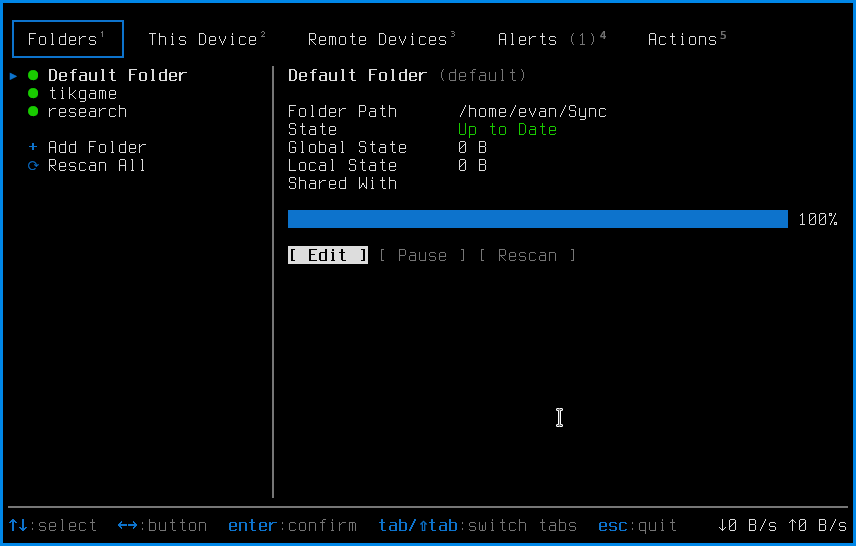

# syncthingtui

A Syncthing TUI client with nearly-complete feature parity with the Syncthing web GUI.



Note that this app was entirely vibe-engineered from `CHAT.txt`

## Install

    go install github.com/evidlo/syncthingtui/cmd/syncthingtui@latest

## Usage

```
Usage of syncthingtui:
  -address string
    	syncthing GUI address (default: from config.xml)
  -api-key string
    	API key (default: from config.xml)
  -fake
    	use fake data instead of a live syncthing
  -list
    	list static screen names
  -screen string
    	render a named screen statically and exit
  -size string
    	WxH for -screen (default "80x60")
```

## Architecture

- `client/` — minimal syncthing REST client + local config.xml discovery
- `app/` — the TUI
  - `app.go` — root router (main view ⇄ subview), static screen presets
  - `main_view.go` — tabs: Folders, This Device, Remote Devices, Alerts, Actions
  - `subviews.go` — Edit Folder / Edit Device / Settings forms (save → REST)
  - `form.go` — browse-then-edit form widget (jk browse, enter edit)
  - `live.go` — polls syncthing, feeds data into the views
- `cmd/syncthingtui` — entry point; `cmd/mockup` — frozen design mockups

## Running Tests

    # run all tests: UI dispatch + layout width tests, plus full REST integration
    # against a temporary syncthing instance in /tmp
    go test ./...

    # pieces, individually:
    ./scripts/test_live.sh      # the REST integration suite on its own
    go run ./scripts/rocheck    # read-only check against your real instance
    go run ./cmd/syncthingtui -list                            # list TUI views
    go run ./cmd/syncthingtui -screen main-folders -size 80x30 # render a view
